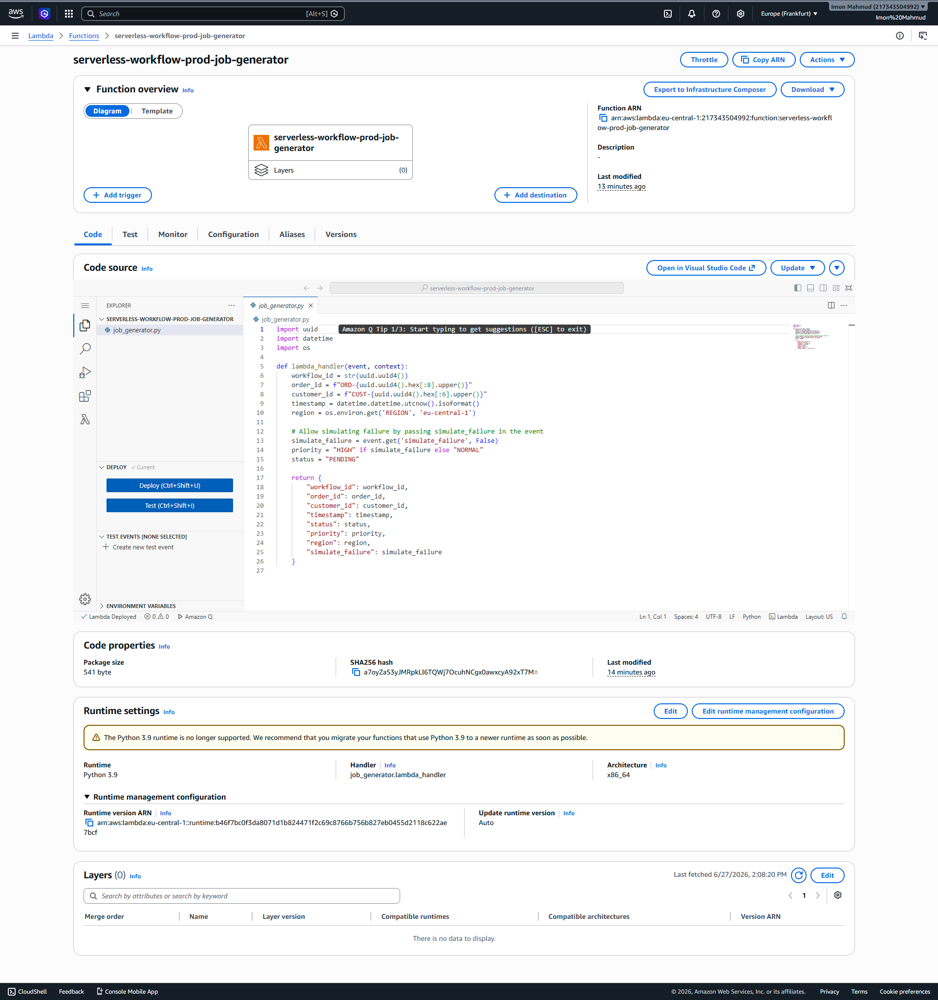
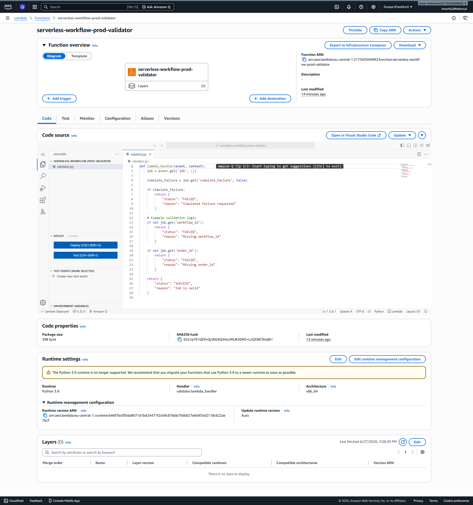
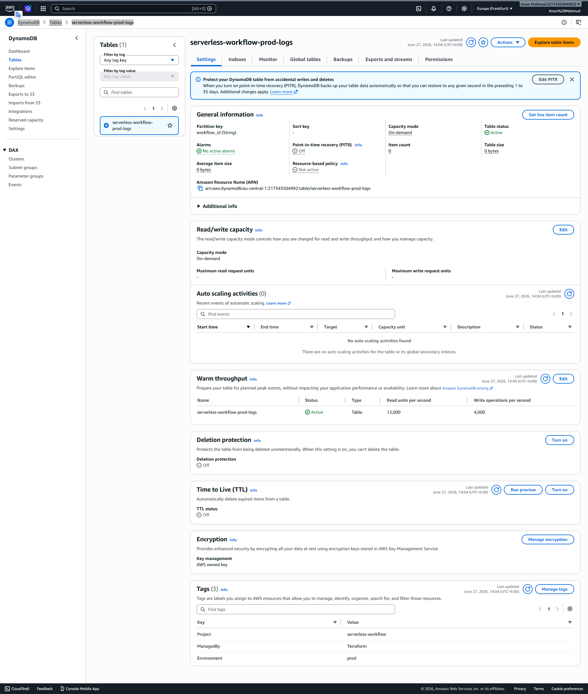
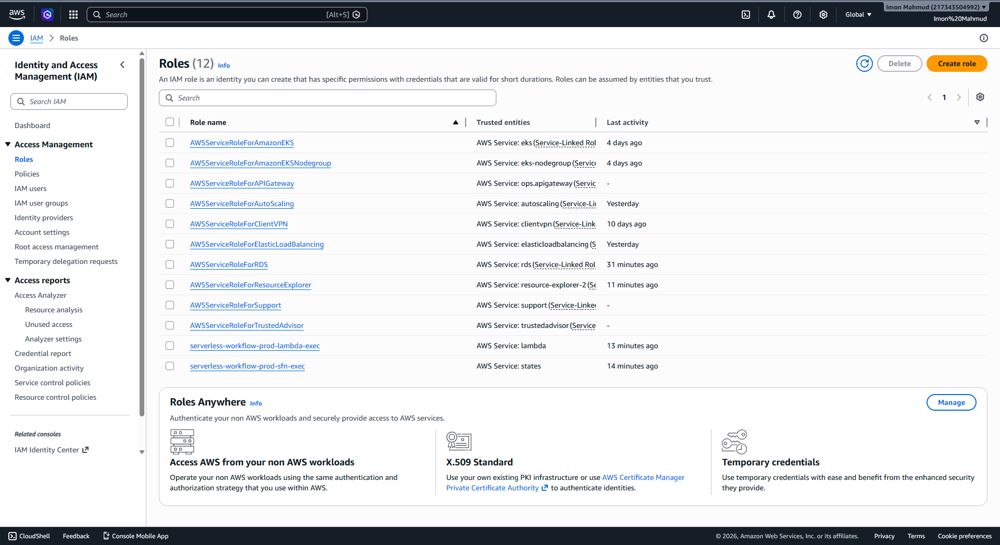

# Enterprise Serverless Workflow Orchestration & Automated State Management


## Table of Contents
- [Executive Summary](#executive-summary)
- [Business Use Case](#business-use-case)
- [Solution Overview](#solution-overview)
- [Features](#features)
- [Architecture Overview](#architecture-overview)
- [Folder Structure](#folder-structure)
- [Technology Stack](#technology-stack)
- [AWS Services Used](#aws-services-used)
- [Terraform Deployment Instructions](#terraform-deployment-instructions)
- [Testing Procedure](#testing-procedure)
- [Validation Results](#validation-results)
- [Screenshot Gallery](#screenshot-gallery)
- [Security Considerations](#security-considerations)
- [Cost Optimization](#cost-optimization)
- [Cleanup Instructions](#cleanup-instructions)
- [Skills Demonstrated](#skills-demonstrated)
- [Future Improvements](#future-improvements)
- [Author](#author)

## Executive Summary
This project demonstrates a production-grade, serverless workflow orchestration system entirely built on AWS using Terraform (Infrastructure as Code) and Python. The goal is to provide a highly resilient, scalable, and automated state management architecture for enterprise workflows, while strictly adhering to AWS Free Tier limits and cloud security best practices (least privilege IAM).

## Business Use Case
Enterprises often require complex, multi-step business processes such as order fulfillment, data pipeline orchestrations, or automated compliance checks. This solution provides a blueprint for a microservices orchestration model using AWS Step Functions, allowing teams to break down monolithic processes into decoupled Lambda functions, route logic dynamically based on validation results, and log execution states automatically to DynamoDB for auditability.

## Solution Overview
The system triggers an AWS Step Functions state machine which coordinates two AWS Lambda functions:
1. **Job Generator Lambda**: Mocks an incoming enterprise payload (Workflow ID, Order ID, Customer ID, Region).
2. **Validator Lambda**: Evaluates the payload for correctness.

A **Choice State** routes the workflow based on the validation result:
- **SUCCESS**: Logs a successful completion record to DynamoDB.
- **FAILED**: Logs a failure record to DynamoDB.
Every state transition is heavily monitored and logged in CloudWatch Logs.

## Features
- **100% Infrastructure as Code (IaC)**: Fully automated deployment via Terraform.
- **Serverless Compute**: Event-driven AWS Lambda functions in Python.
- **Workflow Orchestration**: AWS Step Functions with conditional routing (Choice State).
- **Persistent State Logging**: Automated audit trail in DynamoDB.
- **Comprehensive Observability**: Full execution tracking via CloudWatch.
- **Strict Security**: IAM roles provisioned with absolute least privilege.
- **Zero Cost**: Architected entirely within the AWS Free Tier.

## Architecture Overview
1. Client/Trigger -> AWS Step Functions
2. Step Functions -> Invokes Job Generator (Lambda)
3. Step Functions -> Invokes Validator (Lambda)
4. Step Functions (Choice State) -> Evaluates Validator Output
5. Step Functions -> Writes State to DynamoDB (Success or Failure)
6. CloudWatch continuously monitors Step Functions and Lambda execution logs.

## Folder Structure
```text
.
├── src/
│   ├── job_generator.py
│   └── validator.py
├── versions.tf
├── provider.tf (if combined)
├── variables.tf
├── locals.tf
├── iam.tf
├── dynamodb.tf
├── lambda.tf
├── stepfunctions.tf
├── outputs.tf
├── README.md
└── screenshots/
```

## Technology Stack
- **Cloud Provider**: AWS
- **Infrastructure as Code**: Terraform
- **Programming Language**: Python 3.9
- **Version Control**: Git / GitHub

## AWS Services Used
- AWS Step Functions
- AWS Lambda
- Amazon DynamoDB
- AWS IAM (Identity and Access Management)
- Amazon CloudWatch

## Terraform Deployment Instructions

### Prerequisites
- AWS CLI configured with credentials (`aws configure`).
- Terraform installed (`>= 1.0.0`).

### Deployment
```bash
# Initialize Terraform and download providers
terraform init

# Validate configuration
terraform validate

# Review deployment plan
terraform plan

# Deploy infrastructure
terraform apply -auto-approve
```

## Testing Procedure
You can trigger the workflow manually using the AWS CLI or the AWS Management Console.

**Success Path Test:**
```bash
aws stepfunctions start-execution \
  --state-machine-arn <YOUR_STATE_MACHINE_ARN> \
  --input "{}" \
  --region eu-central-1
```

**Failure Path Test (Simulated):**
```bash
aws stepfunctions start-execution \
  --state-machine-arn <YOUR_STATE_MACHINE_ARN> \
  --input "{\"simulate_failure\": true}" \
  --region eu-central-1
```

## Validation Results
- Verified DynamoDB contains both `SUCCESS` and `FAILED` workflow logs.
- Verified Step Functions execution history perfectly routes based on Choice state.
- Verified CloudWatch captures complete execution details without permission errors.

## Screenshot Gallery

### Step Functions Workflow


### Lambda Functions



### DynamoDB Logs


### CloudWatch Monitoring


### IAM Roles (Least Privilege)


## Security Considerations
- **No Hardcoded Credentials**: Terraform relies on strictly configured local AWS credentials. No secrets are tracked in version control.
- **Least Privilege IAM**: Lambda roles can only execute and write logs. Step Functions role can only invoke specific Lambdas, put items in a specific DynamoDB table, and write to a specific CloudWatch log group.
- **State File Security**: `.gitignore` explicitly prevents `terraform.tfstate` and AWS PEM files from being committed.

## Cost Optimization
- **DynamoDB**: Configured as `PAY_PER_REQUEST` (On-Demand), staying well within the 25 GB free tier limit.
- **Lambda & Step Functions**: Free tier allows millions of requests/transitions per month.
- **CloudWatch**: Standard retention policies implemented to prevent bloat.

## Cleanup Instructions
To avoid any accidental AWS charges, ensure you tear down the infrastructure when done:
```bash
terraform destroy -auto-approve
```

## Skills Demonstrated
- Cloud Architecture & Serverless Design
- Infrastructure as Code (Terraform)
- Microservices Orchestration
- IAM Security Best Practices
- DevOps automation
- Python Development for Cloud

## Future Improvements
- Integrate Amazon EventBridge to trigger the workflow on a schedule.
- Implement a Dead Letter Queue (DLQ) using SQS for unhandled Lambda exceptions.
- Add Terraform remote state backend (S3 + DynamoDB lock) for team collaboration.

## Author
**eng-imonmahmud**  
IT SPECIALIST | CLOUD INFRASTRUCTURE & AI AUTOMATION ENGINEER
